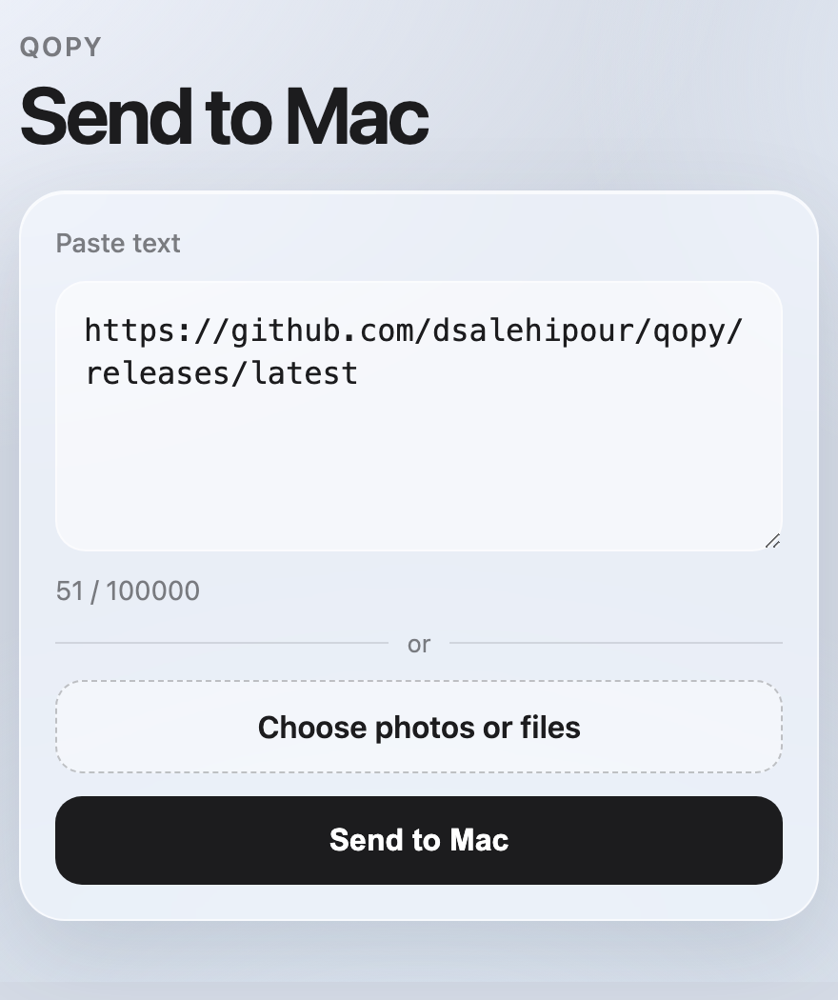

<div align="center">


# Qopy

**Move text, photos, and files between your Mac and Android phone. No accounts, no cloud, no cables.**

<a href="https://github.com/dsalehipour/qopy/releases/latest/download/Qopy.zip"></a>

<sub>Apple Silicon · macOS 26 or later ·
<a href="https://github.com/dsalehipour/qopy/releases/latest">release notes</a> ·
<a href="#build-from-source">build from source</a></sub>

</div>

<br>

Qopy lives in your menu bar. Select text on the Mac, send it as a QR, scan with your phone’s camera,
and copy. Or open the phone page from your Mac, then send text, photos, or files back over Wi‑Fi.

Native Swift. Liquid Glass panels. A tiny static webpage for Android (nothing to install on the
phone beyond a browser).

## Install

Apple Silicon, macOS 26 or later.

1. [**Download `Qopy.zip`**](https://github.com/dsalehipour/qopy/releases/latest/download/Qopy.zip),
   unzip it, and drag `Qopy.app` to Applications.
2. Open it. The first launch may be refused (the app is signed, but not notarized by Apple).
3. Go to **System Settings › Privacy & Security**, scroll to Security, and click **Open Anyway**.
4. When prompted, allow **Accessibility** (reading the current selection). No camera access is needed.

There is no Dock icon: look for the QR glyph in the menu bar.

### Build from source

Needs Xcode 26+ and a Swift 6 toolchain.

```bash
scripts/create-signing-identity.sh   # once per machine
scripts/build-mac.sh                 # Debug build → Mac/build/.../Qopy.app
open Mac/build/Build/Products/Debug/Qopy.app
```

For a Release zip (what GitHub Releases ships):

```bash
scripts/build-release.sh             # → dist/Qopy.app + dist/Qopy.zip
```

macOS pins the Accessibility grant to the app’s signature. Ad-hoc signing changes every
build and silently drops those grants, so the one-off local `qopy-dev` certificate exists to keep
the signature stable. Grant permissions once after the first stably-signed build.

## How it works

### Mac → Phone

1. Select text (or copy it).
2. Choose **Send Selection to Phone** / **Send Clipboard to Phone**, or press **⌃⌥⌘C**.
3. Scan the QR with Android Camera / Lens and tap **Copy**.

### Phone → Mac

<div align="center">



</div>

1. Choose **Receive from Phone…** (or **⌃⌥⌘V**). Qopy shows a QR for the phone page on your Wi‑Fi.
2. Scan that QR with your phone to open the page (same Wi‑Fi as the Mac).
3. Paste text, or tap **Choose photos or files**, then tap **Send to Mac**.

Text lands on the Mac clipboard. Files are saved to **~/Downloads**, and a single image is copied to the
clipboard as well, so ⌘V pastes it straight into Slack, Figma, or a doc. The panel shows what arrived
with a **Show in Finder** button.

The Mac never uses its camera: the phone submits the form and everything arrives over the LAN. The first
transfer asks macOS for access to your Downloads folder.

Esc or a click outside the panel dismisses it. Closing receive stops the local page server.

Mac → phone QR payloads over **1200 UTF-8 bytes** are refused with a warning for now. Phone → Mac over Wi‑Fi allows up to **100000** bytes of text, or **100 MB** per file transfer.

### Services menu

After installing, **Services → Send to Phone with Qopy** is available on selected text in apps that
support Services. If it doesn’t appear yet, log out/in or run `/System/Library/CoreServices/pbs -flush`.

## Phone companion

The `Web/` folder is bundled into the Mac app and served locally when you receive. You can also open
it yourself for development:

```bash
cd Web
python3 -m http.server 8765
```

## Shortcuts

| Shortcut | Action |
| --- | --- |
| **⌃⌥⌘C** | Send current selection to phone |
| **⌃⌥⇧⌘C** | Send clipboard to phone |
| **⌃⌥⌘V** | Receive from phone |

## Development

```
Mac/Qopy/     Swift menubar app (Liquid Glass, QR generation, Accessibility selection)
Web/          Mobile companion page
scripts/      build, release, signing identity, icon tooling
assets/       README artwork
```

Release to GitHub (after committing and pushing `main`):

```bash
scripts/release.sh
```

The release asset is always named `Qopy.zip`, so this link stays valid forever:

`https://github.com/dsalehipour/qopy/releases/latest/download/Qopy.zip`

## Privacy

Everything stays on your devices. Mac → phone uses QR payloads of the text itself (or a small
`qopy:` encoding). Phone → Mac posts text and files over your LAN to the Mac’s local server, which
only runs while the receive panel is open. Nothing is uploaded to the cloud.

## License

MIT
